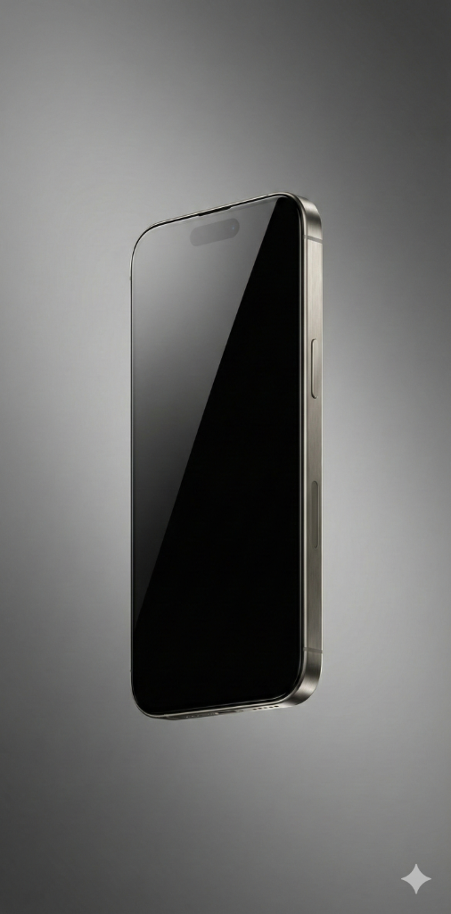

# iPhone 17 Pro Concept Store



Next.js와 Mantine UI를 사용하여 제작한 **iPhone 17 Pro** 컨셉 판매 웹사이트입니다. Apple의 디자인 철학을 반영하여 글래스모피즘(Glassmorphism), 스크롤 기반 애니메이션, 그리고 고급스러운 타이포그래피를 구현했습니다.

## 🌟 주요 기능 (Features)

*   **몰입형 히어로 섹션 (Immersive Hero)**: Framer Motion을 활용한 부드러운 진입 애니메이션과 대형 비주얼.
*   **스크롤 인터랙션 (Scroll-driven Animations)**: 스크롤에 따라 요소들이 우아하게 나타나는 효과.
*   **벤토 그리드 레이아웃 (Bento Grid)**: Apple 스타일의 직관적이고 아름다운 기능 소개 카드.
*   **동적 제품 구매 (Dynamic Buy Section)**: 색상 선택에 따른 실시간 제품 이미지 변경 인터랙션.
*   **반응형 디자인 (Responsive)**: 데스크탑부터 모바일까지 완벽하게 대응하는 레이아웃.

## 🛠 기술 스택 (Tech Stack)

*   **Framework**: [Next.js 15 (App Router)](https://nextjs.org/)
*   **UI Library**: [Mantine v7](https://mantine.dev/)
*   **Animation**: [Framer Motion](https://www.framer.com/motion/)
*   **Styling**: CSS Modules & PostCSS
*   **Language**: TypeScript

## 🚀 시작하기 (Getting Started)

이 프로젝트를 로컬 환경에서 실행하려면 다음 단계를 따르세요.

### 1. 저장소 클론 (Clone)

```bash
git clone https://github.com/your-username/iphone-17-shop.git
cd iphone-17-shop
```

### 2. 패키지 설치 (Install Dependencies)

```bash
npm install
# or
yarn install
```

### 3. 개발 서버 실행 (Run Dev Server)

```bash
npm run dev
```

브라우저에서 [http://localhost:3000](http://localhost:3000)을 열어 확인합니다.

### 4. 빌드 (Build for Production)

```bash
npm run build
npm start
```

## 📂 프로젝트 구조 (Project Structure)

```
iphone-17-shop/
├── app/                # Next.js App Router 페이지 및 레이아웃
├── components/         # 재사용 가능한 UI 컴포넌트 (Header, Hero 등)
├── public/             # 정적 자산 (이미지 등)
├── theme.ts            # Mantine 커스텀 테마 설정
└── ...
```

## 🎨 디자인 시스템

*   **Font**: Inter (San Francisco 대체)
*   **Colors**: Custom Titanium Palette (Natural, Blue, White, Black)

## 📄 라이선스

이 프로젝트는 학습 및 포트폴리오 목적으로 제작된 비상업적 프로젝트입니다. iPhone 및 Apple 관련 상표권은 Apple Inc.에 있습니다.
